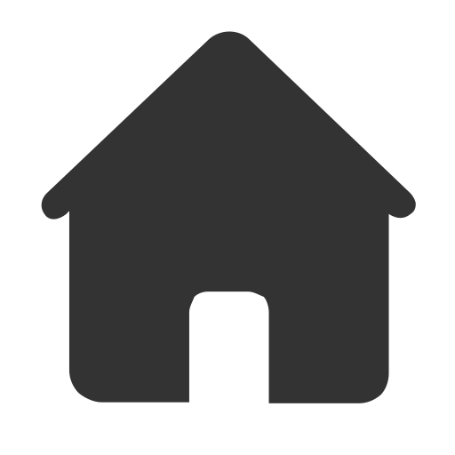
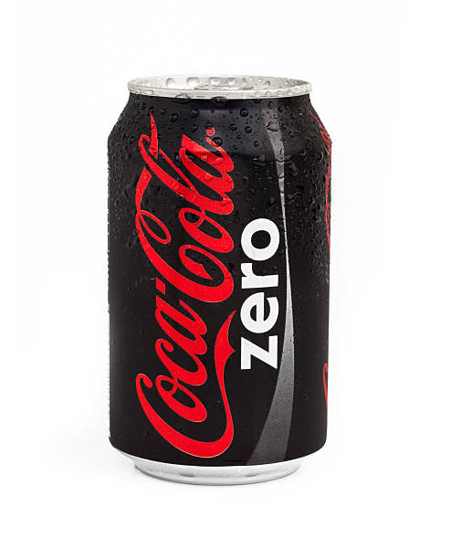
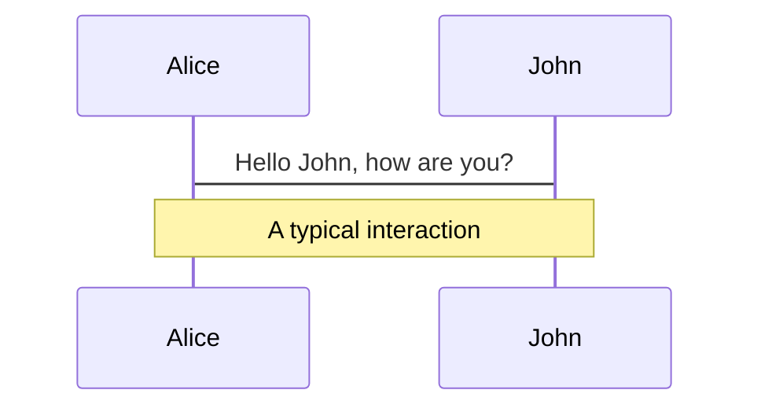
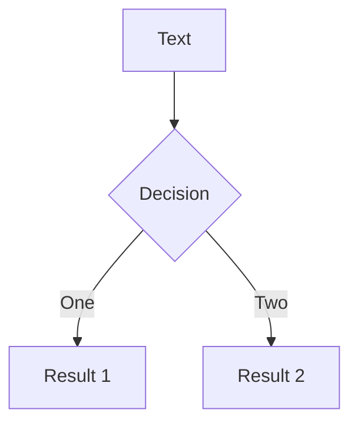
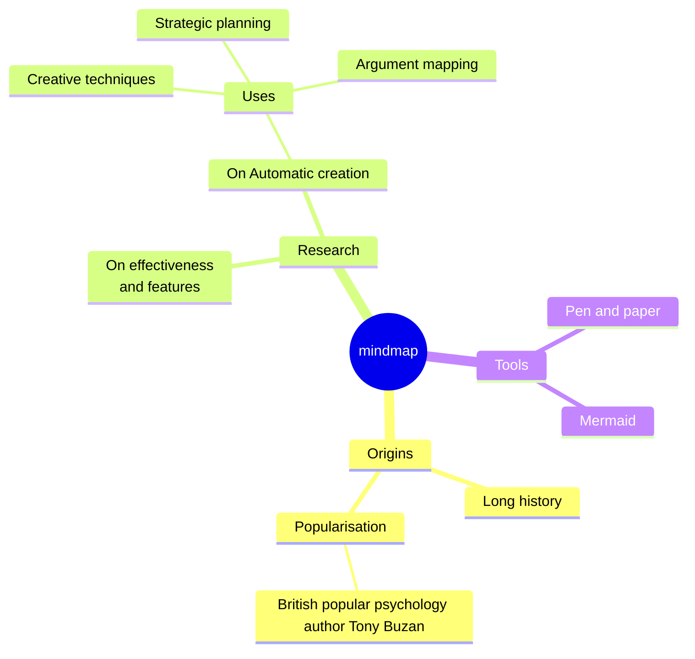
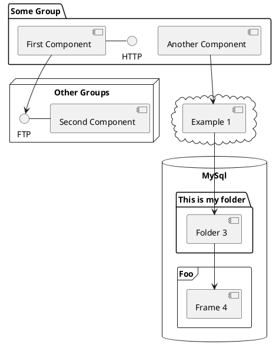

---
# You can also start simply with 'default'
theme: default
# random image from a curated Unsplash collection by Anthony
# like them? see https://unsplash.com/collections/94734566/slidev
background: https://source.unsplash.com/collection/94734566/1920x1080
# some information about your slides (markdown enabled)
title: Innovation Journey
info: |
  Personal 1-1 meeting presentation on AI, Cloud, and innovative work.
# apply unocss classes to the current slide
class: text-center
# https://sli.dev/features/drawing
drawings:
  persist: false
# slide transition: https://sli.dev/guide/animations.html#slide-transitions
transition: slide-left
# enable MDC Syntax: https://sli.dev/features/mdc
mdc: true
---

  
  1 - 1 with 
  

  

    

      

        
      

      

        {{ topic.name }}
      

    

  

---

# Why AI Coding?

AI Coding refers to the use of artificial intelligence technologies to assist or automate parts of the software development process.
 
- ⚡ **Increased Productivity** - Automates repetitive tasks, speeding up the development process.
- 🛡️ **Improved Code Quality** - Detects bugs, vulnerabilities, and suggests cleaner code.
- 🚀 **Faster Learning Curve** - Assists beginners with code suggestions and explanations.
- 🐞 **Enhanced Debugging** - Identifies and fixes bugs more efficiently.
- 🧠 **Customization and Optimization** - Provides personalized code suggestions based on your coding style.
- 🔍 **Better Code Review** - Automates code review, ensuring best practices and standards.
- 🔧 **Automated Refactoring** - Automatically improves existing code to be more efficient and readable.
 

  

---

# AI Coding Tools

- GitHub Copilot
- Tabnine
- Kite
- Cursor
- DeepCode
- Codeium
- Replit
- OpenAI Codex

 

<n-space>
  Go to AI Coding Tools Navigation

  <n-drawer title="AI Coding Tools" :active="show" @close="closeDrawer()">
    <iframe width="1400" height="100%" :src="url" frameborder="0"></iframe>
  </n-drawer>
</n-space>

  

---

# My AI Coding Experience

- EEE Formula Development --- Coco
- Draw PlantUML Diagram
- Draw Canvas ICON
- Develop Script for Script Runner
- Develop Web Tool
- Write PPT via slidev

  

---

# Laaa's Evil Idea

- Cloud technologies you're working with
- Innovative cloud solutions
- Impact on the business

  

---

# Amazing Work

- Highlight your most impressive projects
- Key achievements and innovations
- Future goals and aspirations

  

---

# Diagrams

You can create diagrams / graphs from textual descriptions, directly in your Markdown.

Learn more: [Mermaid Diagrams](https://sli.dev/features/mermaid) and [PlantUML Diagrams](https://sli.dev/features/plantuml)

---
layout: iframe

# the web page source
url: http://localhost:8080/
---

---

## 抽屉功能

功能：嵌入 iframe 等内容

 

<n-space>
  鼠标悬浮此处打开抽屉

  <n-drawer title="AI Coding Tools" :active="show" @close="closeDrawer()">
    <iframe width="1400" height="100%" :src="url" frameborder="0"></iframe>
  </n-drawer>
</n-space>

